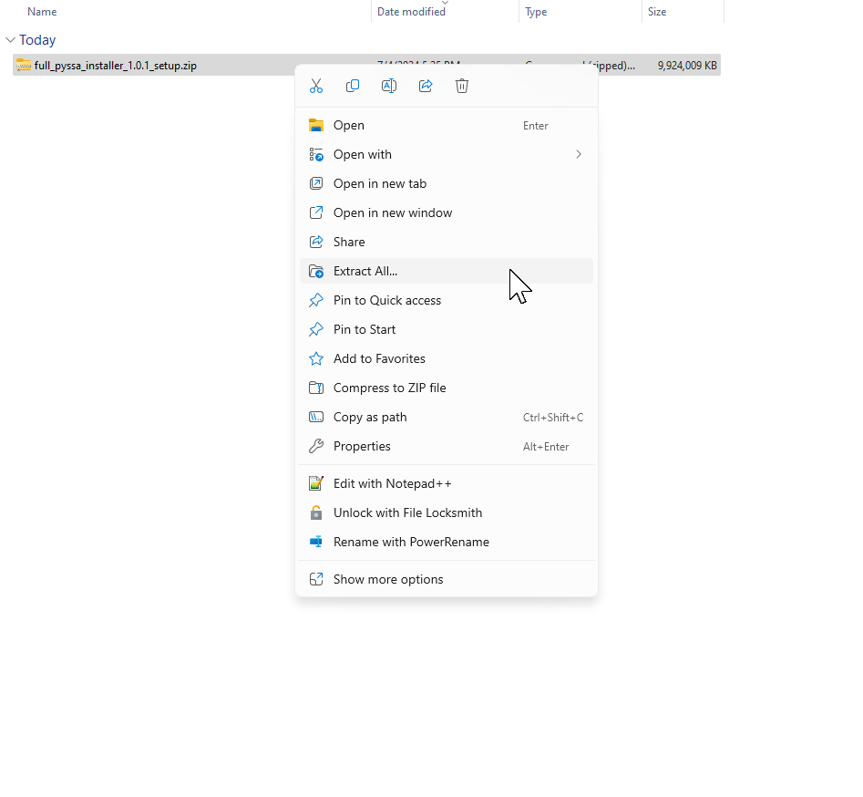
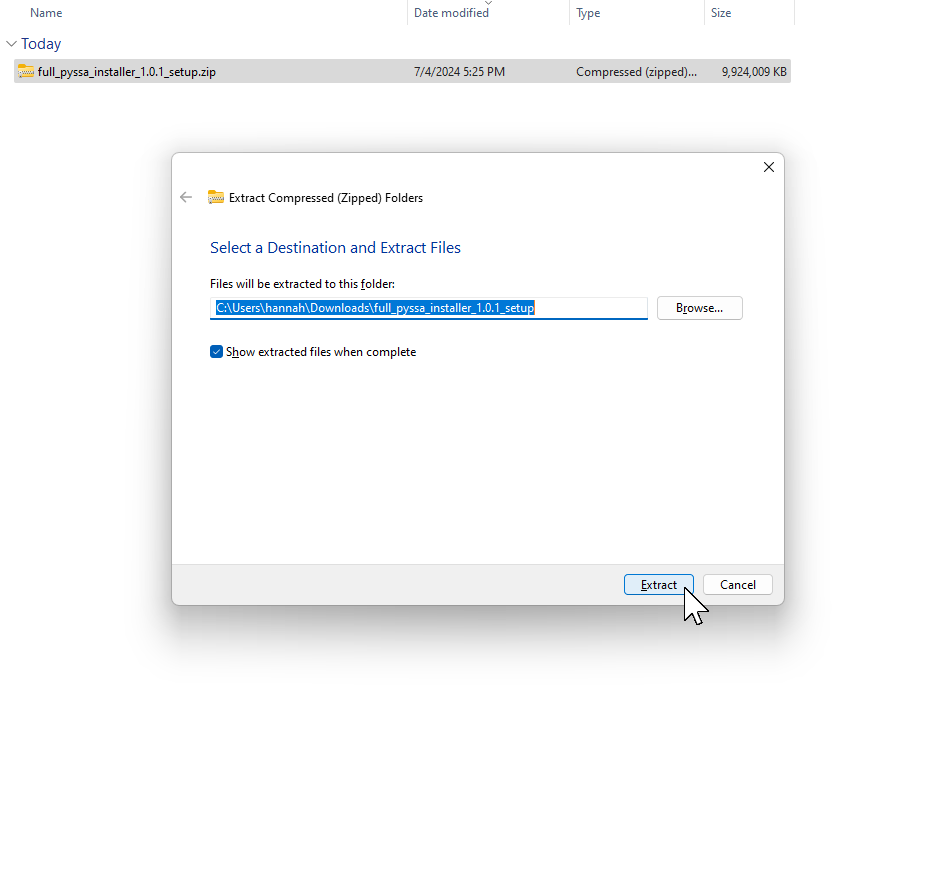
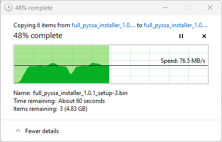
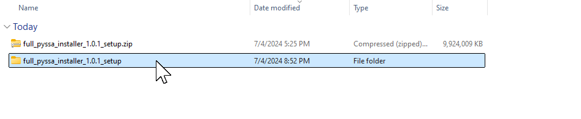
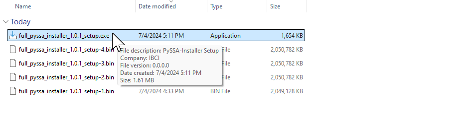
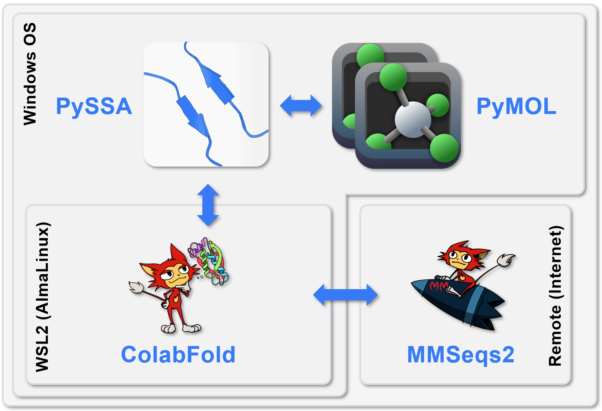

# PySSA
<!--  -->

  

# Python rich client for visual protein Sequence to Structure Analysis (PySSA)

## Contents of this document
* [Description](#Description)
* [Contents of this repository](#Contents-of-this-repository)
  * [Sources](#Sources)
  * [Documentation](#Documentation)
  * [Assets](#Assets)
* [Installation](#Installation)
    * [Windows](#Windows)
      * [Normal installation](#normal-installation)
      * [Offline environment](#offline-environment)
      * [Online installation (For experts)](#online-installation-for-experts)
    * [Source code](#Source-code)
* [Dependencies](#Dependencies)
* [Architecture](#Architecture)
* [Citation](#Citation)
* [References and useful links](#References-and-useful-links)
* [Acknowledgements](#Acknowledgements)

## Description
PySSA ('Python rich client for visual protein Sequence to Structure Analysis') is an open software project that 
aims to combine PyMOL and ColabFold to enable the prediction and analysis of 
3D protein structures for the scientific end-user.
PySSA allows the creation of managed and shareable projects with defined workflows for 
the prediction and analysis of protein structures, 
which can be conveniently carried out by scientists without 
any special computer skills or programming knowledge on their local computers. 
PySSA can help make protein structure prediction accessible for research and 
development in protein chemistry and molecular biology, and for teaching.  
In addition to the prediction and analysis capabilities, PySSA has a more user-friendly interface 
for interacting with PyMOL, such as creating high-quality ray-tracing images in a few clicks.
<!-- The scientific article describing PySSA can be found here: <a href="doi"> Title </a> -->

## Contents of this repository
### Sources
There are five different Python packages that contain functionality for specific aspects of the architecture. 

- _pyssa_ 
  - The package contains Python modules, Qt .ui files and cascading stylesheets.
- _application_process_
  - The package contains a Python module for the _ApplicationProcessManager_ class.
- _auxiliary_pymol_ 
  - The package contains Python modules for the communication and integration of _Auxiliary PyMOL_.
- _pyssa_colabfold_
  - The package contains a modified version of the [_batch.py_](https://github.com/sokrypton/ColabFold/blob/main/colabfold/batch.py) module of the [ColabFold library](https://github.com/sokrypton/ColabFold). Moreover, the package contains the colabfold_run.py  and the service.py module for managing the ColabFold microservice.
- _pyssa_pymol_
  - The package contains Python modules for the communication and integration of _User PyMOL_.

### Documentation
The <a href="https://github.com/urban233/PySSA/tree/main/docs">"docs"</a> folder 
contains the end-user documentation in the form of markdown and HTML files. 
The subfolder <a href="https://github.com/urban233/PySSA/tree/main/docs/dev-notes">"dev-notes"</a>, contains development notes.

Use cases describing specific workflows can be found here (Available soon). 

### Assets
The <a href="https://github.com/urban233/PySSA/tree/main/assets">"assets"</a> folder consists of
the subfolder <a href="https://github.com/urban233/PySSA/tree/main/assets">"images"</a> which contains the PySSA logo.
If you are using PySSA for your own projects, you are welcome to give credit to PySSA by using the logo in your presentations, etc.

## Installation
PySSA is tested and available for Windows 10 and 11.
### Windows
For a convenient and user-friendly installation, 
the <a href="https://github.com/urban233/ComponentInstaller">"PySSA Component Installer"</a> is available
(click <a href="https://zenodo.org/records/12666581/files/full_pyssa_installer_2024.07.1_setup.zip?download=1">here</a> to automatically download the _full_pyssa_installer_2024.07.1_setup.zip_).

**Important:**
* WSL2 **cannot** be uninstalled, once it is installed! Windows will integrate the WSL2 as a system component.
* Be aware that the computer needs to be **restarted** after installing WSL2.

#### Normal installation
**Installation steps:**
1. Download the full PySSA Component Installer package (click [here](https://zenodo.org/records/12666581/files/full_pyssa_installer_2024.07.1_setup.zip?download=1) to download).
2. Go to the _Downloads_ folder and extract the downloaded ZIP file.
3. Open the extracted folder and run _full_pyssa_installer_2024.07.1_setup.exe_, then follow the instructions.
4. To open the PySSA Component Installer, click on the newly created desktop icon.
5. Install all missing components.
6. After installing all components, open PySSA by double-clicking the created shortcut on the desktop.

**Important note:**

If you are installing PySSA for the first time, you need to specify a workspace directory. 
This means that the window arrangement (the underlying WinBatch) will fail and show an error message. 
This **is normal**. To resolve this, click OK and either exit the application 
(via Project > Exit Application) or rearrange the windows using the menu Help > Rearrange Windows.

**How to extract a ZIP file**
1. Open the context menu (right-click) on the downloaded ZIP file.

  

2. Click on _Extract_ to unzip the file to the default location.

  

3. Wait until the extraction process finishes.

  

4. If you are in the Downloads folder after the extraction, open this folder.

  

5. Double-click on the .exe file to start the installation process of the PySSA Component Installer.

  

#### Offline Environment
If no internet connection is available, download the _full_pyssa_installer_2024.07.1_setup.zip_ on a computer 
with a working internet connection and then move the zip file to the target machine.
Be aware that the WSL2 installation needs an internet connection and can therefore be not installed 
through the installer and must be set up beforehand.
This means an installed WSL2 environment is for an offline installation a prerequiste.

#### Online Installation (For experts)
Go to [Releases](https://github.com/urban233/PySSA/releases) to download the _only_pyssa_installer_1.0.2.exe_ file. 
This will download a setup that installs the PySSA Component Installer but does not include ColabFold and PySSA. 
These components will be downloaded automatically during the installation process.
This installation approach could lead to errors due to an unstable internet connection. 
It is advised to download the full package (which includes ColabFold and PySSA) for a more reliable installation.

The PySSA Component Installer [user guide](https://github.com/urban233/ComponentInstaller/blob/v1.0.1/deployment/inno_setup/PySSA-Component-Installer-User-Guide.pdf) is available in the installer's menu under _Help_.
If WSL2 or ColabFold installation fails, consult the user guide and read the troubleshooting section.

### Source code
This is a Python project based on a virtual environment. 
To modify the source code, download or clone the repository 
and open it in an IDE that supports virtual environments (e.g. PyCharm).
Finally, run `pip install -r requirements_dev.txt` to set up the virtual environment used for development.

The project supports using a setup.py file to create a package that works with the PySSA Component Installer.
To build the package run `python setup.py create_win_package`.

The setup.py also supports building the documentation using the command:
`python setup.py make_docs`.

## Dependencies
**Managed by PySSA-Installer:**
* Windows Subsystem for Linux 2
  * WSL2
  * License: Microsoft Software License Terms
* Colabfold
  * [LocalColabfold](https://github.com/YoshitakaMo/localcolabfold)
  * License: MIT License
* [PyQt5](https://riverbankcomputing.com/software/pyqt/intro)
  * License: GNU General Public License (GPL)
* [NumPy](https://numpy.org/)
  * License: BSD 3-Clause "New" or "Revised" License
* [Pandas](https://github.com/pandas-dev/pandas)
  * License: BSD 3-Clause "New" or "Revised" License
* [Matplotlib](https://matplotlib.org/)
  * License: Python Software Foundation License (PSF)
* [Biopython](https://biopython.org/)
  * License: BSD 3-Clause License
* [PyMOL Open-Source](https://github.com/schrodinger/pymol-open-source)
  * License: [BSD-like license](https://github.com/schrodinger/pymol-open-source/blob/master/LICENSE)
* SQLite3
  * License: [Public Domain](https://www.sqlite.org/copyright.html)

## Architecture

  

## Citation
You can cite this software or this repository as it is defined in the CITATION.cff file.

## References and useful links
**ColabFold**
* [ColabFold GitHub repository](https://github.com/sokrypton/ColabFold)
* [Localcolabfold GitHub repository](https://github.com/YoshitakaMo/localcolabfold)
* [Mirdita, M., Schütze, K., Moriwaki, Y. et al. ColabFold: making protein folding accessible to all. Nat Methods 19, 679–682 (2022). https://doi.org/10.1038/s41592-022-01488-1](https://doi.org/10.1038/s41592-022-01488-1)

**PyMOL**
* [Open-source GitHub repository](https://github.com/schrodinger/pymol-open-source)
* [Open-source Windows Python wheelfiles](https://github.com/cgohlke/pymol-open-source-wheels)

## Acknowledgements
**Developers:**
* Martin Urban
* Hannah Kullik

**End-user testers**
* Jonas Schaub
* Achim Zielesny

**Logo:**
* Martin Urban
* Hannah Kullik

**Initialization, conceptualization, and supervision:**
* Achim Zielesny and Angelika Loidl-Stahlhofen

**The PySSA project team would like to thank
the communities behind the open software libraries and especially Warren L. DeLano
for their amazing work.**

<!--
**PySSA was developed at:**
 
 Zielesny Research Group
 Westphalian University of Applied Sciences
 August-Schmidt-Ring 10
 D-45665 Recklinghausen Germany
--!>

