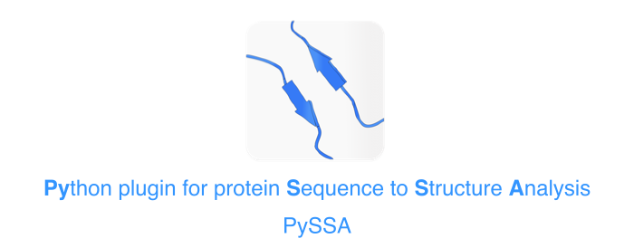
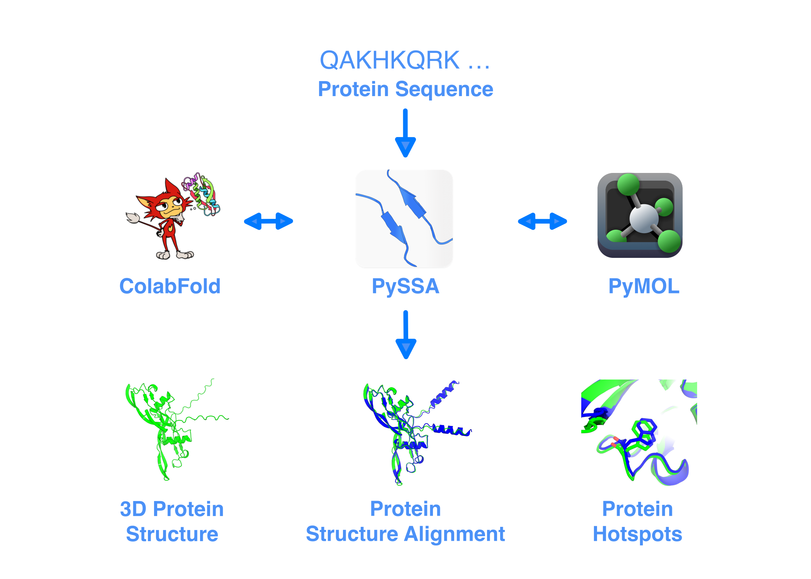

# PySSA

The Python-Plugin for Protein Sequence-to-Structure Analysis (PySSA), is a PyMOL plugin which comes as a bundle together with
the open-source version of PyMOL. Therefore, you do not need an existing PyMOL installation.
This plugin combines the local colabfold which is based on DeepMind's AlphaFold with the molecular visualization software PyMOL.
Besides the prediction capabilities, the plugin offers also a distance analysis for a protein pair and
makes PyMOL more accessible, due to a more intuitive user interface.

## Description
PySSA ('Python plugin for protein Sequence to Structure Analysis') is an open software project that
enables protein structure predictions and analysis on a local computer. The GUI-Plugin offers
extensive graphical functions for visualising and evaluating the quality of structure prediction.
In addition, it is possible to create high quality images of protein structures in a few clicks.
<!-- The scientific article describing PySSA can be found here: <a href="doi"> Title </a> -->

## Installation
Until now, PySSA is tested and available for Windows 10 and 11.
### Windows
For a convenient and user-friendly installation, the <a href="https://github.com/urban233/PySSAInstaller">"PySSA-Installer"</a> is available
(click <a href="https://github.com/urban233/PySSAInstaller">here</a> to
automatically download the installer .exe of the latest version).
Download the installer
executable, start, and follow the instructions to install the PySSA-Installer.
After that, open the installer and install each component (WSL2, LocalColabfold and PySSA)
one after the other.
To start PySSA, double-click the created shortcut on the desktop.
To uninstall PySSA, open the PySSA-Installer and uninstall the components which
should get removed.

## Dependencies
**Managed by PySSA-Installer:**

* Windows Subsystem for Linux 2
    * WSL2
    * License: Microsoft Software License Terms
* Colabfold
    * [LocalColabfold](https://github.com/YoshitakaMo/localcolabfold)
    * License: MIT License
* [Mamba](https://github.com/mamba-org/mamba)
    * License: BSD 3-Clause "New" or "Revised" License
* [PyQt5](https://riverbankcomputing.com/software/pyqt/intro)
    * License: GNU General Public License (GPL)
* [NumPy](https://numpy.org/)
    * License: BSD 3-Clause "New" or "Revised" License
* [Pandas](https://github.com/pandas-dev/pandas)
    * License: BSD 3-Clause "New" or "Revised" License
* [Matplotlib](https://matplotlib.org/)
    * License: Python Software Foundation License (PSF)
* [Biopython](https://biopython.org/)
    * License: BSD 3-Clause License
* [PyMOL Open-Source](https://github.com/schrodinger/pymol-open-source)
    * License: [BSD-like license](https://github.com/schrodinger/pymol-open-source/blob/master/LICENSE)
* SQLite3
    * License: [Public Domain](https://www.sqlite.org/copyright.html)