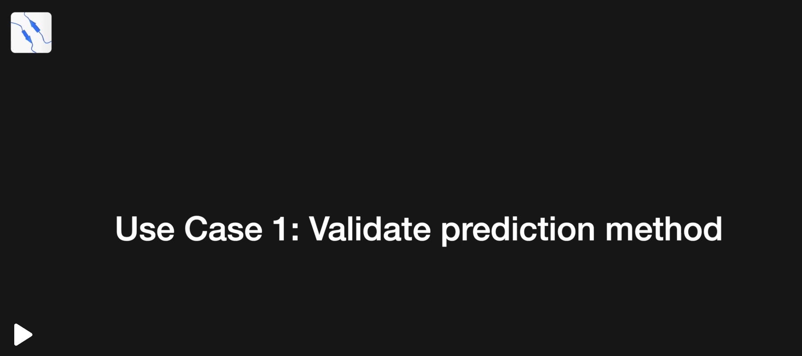
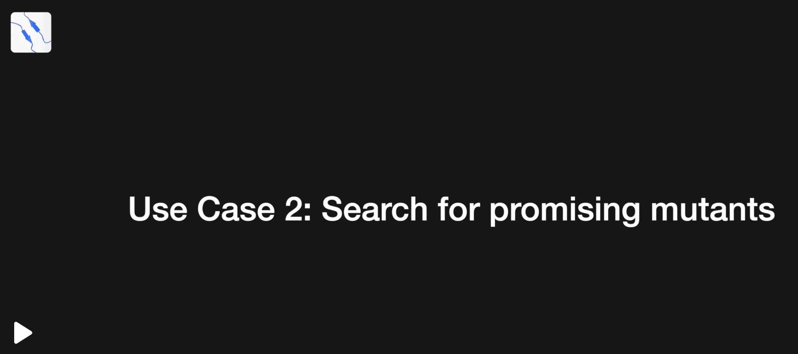
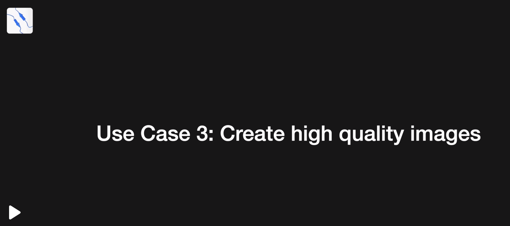

# Stream
The following section presents the three available use cases for streaming. 
Upon clicking on a use case, users will be redirected to a [Sciebo](https://hochschulcloud.nrw/) website containing the relevant video. 
You can either watch the video directly or download it. 
Additionally, each use case can be downloaded from the [Download](#Download) section.

## Use Case 1
This use case outlines the validation of ColabFold's prediction capabilities through the prediction of the monomeric BMP2 structure and a comparison with a reference protein (6OMN) elucidated by X-ray crystallography. The analysis is centered on structural alignment, RMSD value, and crucial residues for receptor interaction. The results demonstrate that while the majority of the structure is accurately predicted, some essential residues exhibit reasonable deviations.

## Use Case 2
This use case illustrates the process of predicting and analyzing a mutated BMP2 protein, which is then compared against the wild-type protein. The analysis entails evaluating the structural differences of residues that are involved in key interactions with BMPR-1 receptors. The results demonstrate that while the BMP2 variant's structure is largely aligned with the wild type, there are notable differences in critical residue distances.

## Use Case 3
In this third use case, the objective is to generate a detailed image of the tryptophan 31 residue from the BMP2 wild-type and BMP2-2Hep-7M variant proteins, with a particular focus on its side-chain atoms. The process begins with opening the relevant protein pair in PyMOL, followed by the selection and zooming in on the tryptophan residue. Thereafter, the view and transparency are adjusted, and finally, a high-quality, ray-traced image is saved.

## Download
Here you can download all three use cases as MP4 files:

- [Use Case 1](https://w-hs.sciebo.de/s/o6vMwrlWeZgzMpP/download)
- [Use Case 2](https://w-hs.sciebo.de/s/SHfI0MIho7eSeF5/download)
- [Use Case 3](https://w-hs.sciebo.de/s/ef6bim1oo4XeraB/download)
