==============
 Installation
==============

Windows
=======
**Caution**: The PySSA.pkg contains a fully functional open-source version of PyMOL +
the PySSA plugin.
Therefore you do not need a PyMOL!
The plugin will also not be integrated in previous PyMOL installations!

The installation process was tested on a Windows 10 21H2 and on a Windows 11 21H2 system.

To start the installation process, double click on the
downloaded PySSA_setup.exe.

.. image:: assets/images_win/win_download_dir.png
    :align: center

It is possible that the Windows Defender will pick up
the installer. If that happens, click on *More Info*
and on *Run Anyway*.

.. image:: assets/images_win/win_defender_dialog.png
    :align: center

1. Confirm start of installation.
---------------------------------
After that, a small dialog will open, which asks you,
if you want to install the PySSA software.
Click on *Yes* to continue.

.. image:: assets/images_win/win_wish_to_install.png
    :align: center

2. Grant Admin privileges.
--------------------------
Next, a dialog will open, which asks you to confirm
you have the right privileges to run the setup.
(Admin privileges are needed!)
After the confirmation the introduction dialog will open.

3. Click on *Next*.
-------------------
There you can click on *Next*.

.. image:: assets/images_win/win_introduction.png
    :align: center

4. Agree to both licenses.
--------------------------
Read both licenses. One is for the open-source version of PyMOL
and the other is for the PySSA.

.. image:: assets/images_win/win_license.png
    :align: center

5. Confirm destination location.
--------------------------------
You should **not** change the pre-defined destination folder!

Just click on *Next*.

.. image:: assets/images_win/win_program_dir.png
    :align: center

6. Confirm start menu folder.
-----------------------------
You should **not** change the default value!

Just click on *Next*.

.. image:: assets/images_win/win_menu_folder.png
    :align: center

7. Install open-source version of PyMOL.
----------------------------------------
To install the open-source version of PyMOL, click on *Install*.

.. image:: assets/images_win/win_install.png
    :align: center

8. Install Anaconda.
--------------------
In this step a full Anaconda version will be installed. Just follow the
instructions on the screen. The installer opens **automatically**!

If you have already an Anaconda installation, proceed with step 16.
(A valid installation is located either under C:\Users\your-username\anaconda3 or
C:\Program Data\anaconda3)

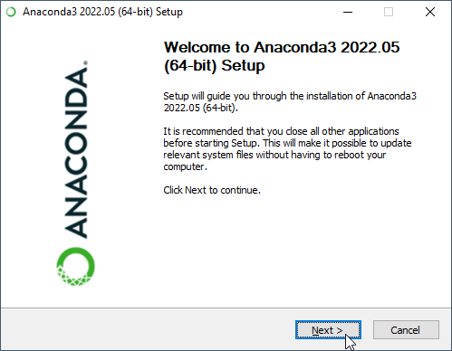

9. Agree to the license from Anaconda.
--------------------------------------
The next step is, to agree to the given license. Just click on *I Agree*.

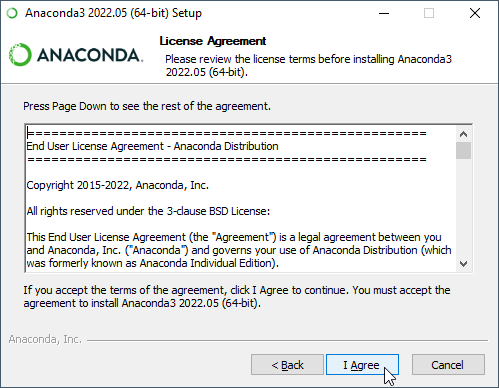

10. Choose Installation Type.
-----------------------------
After you agreed to the license, you have to choose an installation type.
It is recommended that you choose *Just Me*!

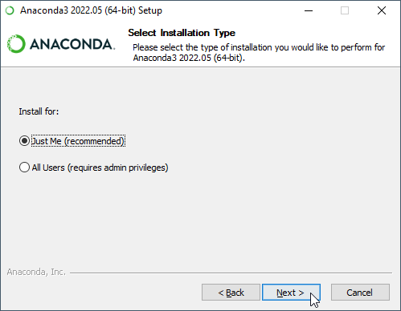

11. Confirm Installation Location.
----------------------------------
Next, you have to confirm the installation location, by clicking on *Next*.
Do **not** change the given path!

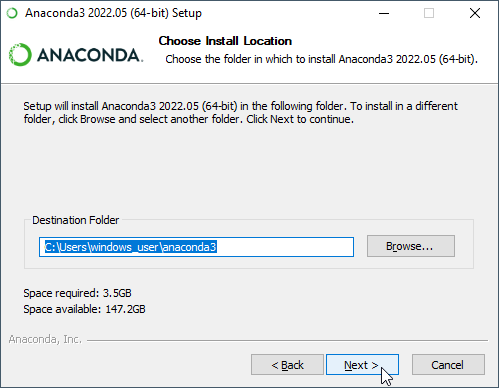

12. Confirm Advanced Installation Options.
------------------------------------------
The next step is to confirm the advanced installation options.
This can be done, by clicking on *Install*.
Do **not** change anything in this dialog!

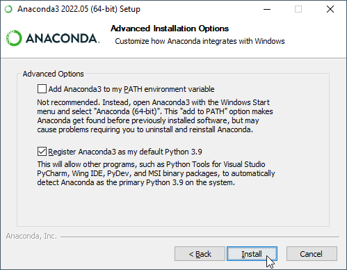

13. Confirm Completion of Installation.
---------------------------------------
After the installation of Anaconda finished, you have to click on *Next*.

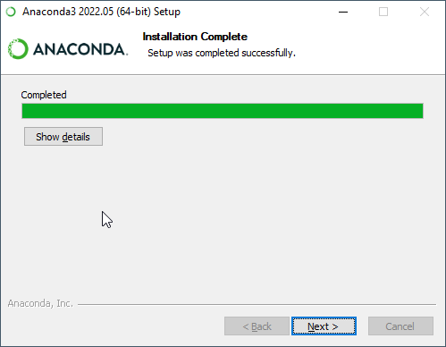

14. Click on *Next*.
--------------------
Just click on *Next*.

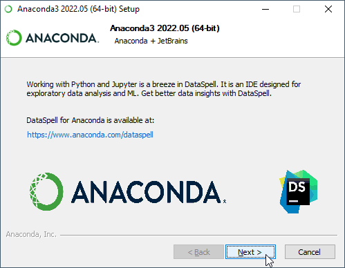

15. Finish Anaconda Setup.
--------------------------
The last step of the Anaconda Setup is, to remove the both checks from the
two given checkboxes. After that click on *Finish*.

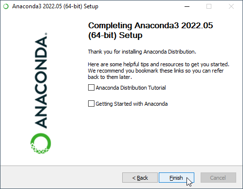

16. Confirm the Anaconda Installation.
--------------------------------------
After you installed Anaconda, or you have Anaconda already installed, press the *Enter* key,
to proceed with the installation process.

**Important Note**: The powershell window (the blue window) should be the active one!

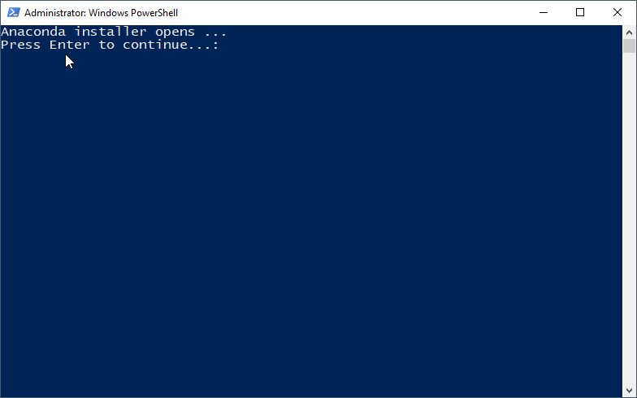

17. Finish installation of open-source PyMOL.
---------------------------------------------
Finally, to finish the setup, click on *Finish*.

.. image:: assets/images_win/win_finish_install.png
    :align: center

18. Start PyMOL-PySSA.
----------------------
To install the PySSA PyMOL plugin, you have to start PyMOL with by clicking on the
*PyMOL-PySSA* desktop icon.

.. image:: assets/images_win/win_pymol_icon.png
    :align: center

19. Navigate to *Plugin*.
-------------------------
After you successfully launched PyMOL, navigate in the menu bar to *Plugin*.

.. image:: assets/images_win/win_pymol_plugin.png
    :align: center

20. Open the *Plugin Manager*.
------------------------------
If you click on *Plugin* in the menu bar, a dropdown menu will occur. There you have to click on
*Plugin Manager*.

.. image:: assets/images_win/win_pymol_plugin_manager_click.png
    :align: center

21. Install New Plugin.
-----------------------
In the Plugin Manager, navigate to *Install New Plugin* and then click on *Choose file ...*.

.. image:: assets/images_win/win_pymol_plugin_manager.png
    :align: center

22. Open the PySSA.zip.
-----------------------
After you clicked on *Choose file ...* a file dialog will open. There you have to click on *.pyssa*
in the top bar of the explorer.

.. image:: assets/images_win/win_plugin_path_info.png
    :align: center

After you clicked on *.pyssa*, the folder will open and there you have to click on *pyssa.zip*.
And then on *Open*.

.. image:: assets/images_win/win_pymol_plugin_zip.png
    :align: center

23. Confirm Installation Path.
------------------------------
Next, a dialog will open, which displays a file path.

Just click on *OK*. And wait a little bit.

Do **not** change the path!

.. image:: assets/images_win/win_pymol_plugin_install_path.png
    :align: center

24. Confirm Installation.
-------------------------
If the installation was successful, a dialog will open which says that
the plugin was installed successfully.

There you have to click on *OK*.

.. image:: assets/images_win/win_pymol_plugin_install_finish.png
    :align: center

25. Open the PySSA Plugin.
--------------------------
To open the PySSA plugin, navigate to *Plugin* and click on *PySSA*.
The plugin should open, after a few seconds.

.. image:: assets/images_win/win_activate_plugin.png
    :align: center

26. Basic PyMOL-PySSA Window Setup.
-----------------------------------
To work with both, PyMOL and PySSA at the same time, you can split the window in two half's,
by dragging the PyMOL window to the right side of your screen and select the PySSA window on the
left side. After that you can resize both windows, if you navigate with your mouse to the center and
move the window to the right side.

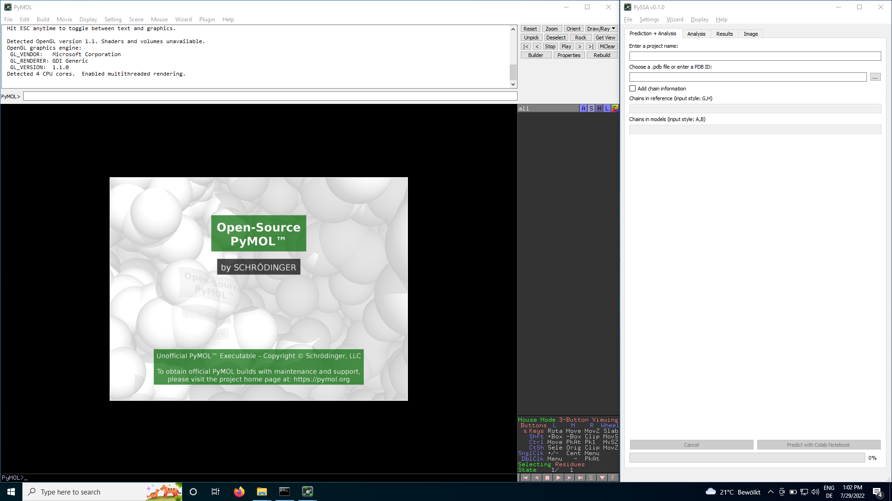

Uninstall
---------
Easy way
^^^^^^^^

1. Search for "programs" in Windows search bar.
~~~~~~~~~~~~~~~~~~~~~~~~~~~~~~~~~~~~~~~~~~~~~~~
To remove the PySSA, search in the Windows search bar for "programs".

Then choose "Add or remove programs".

.. image:: assets/images_win/win_search_programs.png
    :align: center

2. Select Uninstall.
~~~~~~~~~~~~~~~~~~~~
Go through the list of programs and find the PySSA program.
After that, you click on *Uninstall*.

.. image:: assets/images_win/win_delete_programs.png
    :align: center

3. Uninstall PySSA.
~~~~~~~~~~~~~~~~~~~
To finally uninstall the PySSA click on *Uninstall* in the new dialog window, which appeared after
the last Uninstall-click. This uninstalls also the open-source version of PyMOL!

.. image:: assets/images_win/win_delete_programs_confirm.png
    :align: center

4. Search for Anaconda.
~~~~~~~~~~~~~~~~~~~~~~~
If you want to also remove Anaconda, search for it in the programs list.

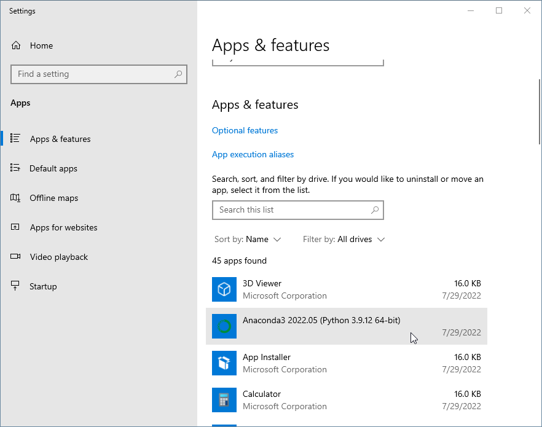

5. Select Uninstall.
~~~~~~~~~~~~~~~~~~~~
Click on Anaconda and then on *Uninstall*.

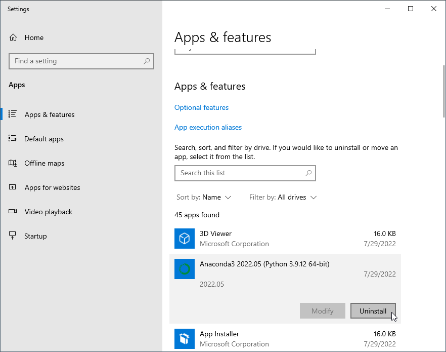

6. Uninstall Anaconda.
~~~~~~~~~~~~~~~~~~~~~~
To finally uninstall the Anaconda click on *Uninstall* in the new dialog window, which appeared after
the last Uninstall-click.

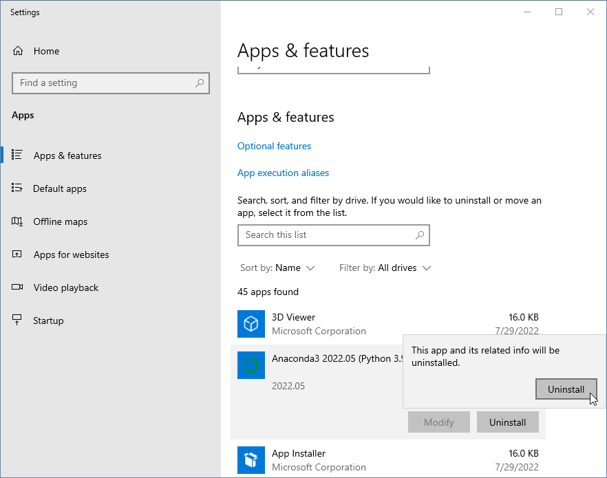

Advanced way
^^^^^^^^^^^^

1. Select unins000.
~~~~~~~~~~~~~~~~~~~
First you select *unins000* with a click on it.

You can find it at: C:\\Users\\your-username\\.pyssa

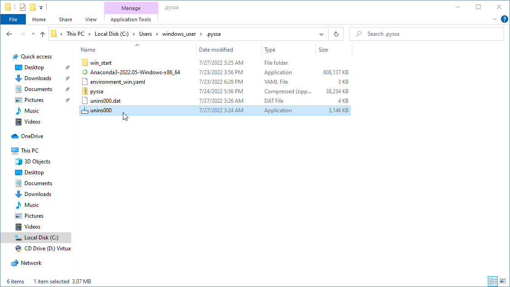

2. Uninstall PySSA.
~~~~~~~~~~~~~~~~~~~
To finish the uninstallation process, click on *Yes*.

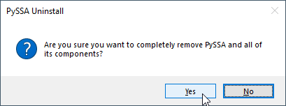

3. Finished Uninstallation.
~~~~~~~~~~~~~~~~~~~~~~~~~~~
If the uninstall was successful, a dialog window appears, which informs you, that the
uninstall has been done.

Then you click on *OK*.

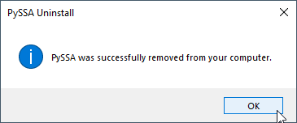

MacOS
=====

**Caution**: The PySSA.pkg contains a fully functional open-source version of PyMOL +
the PySSA plugin.
Therefore you do not need a PyMOL!
The plugin will also not be integrated in previous PyMOL installations!

The installation was tested on a 2015 MacBook Pro, with macOS Monterey version 12.4.

To install PySSA, you have to run the PySSA.pkg file, by double clicking on it.

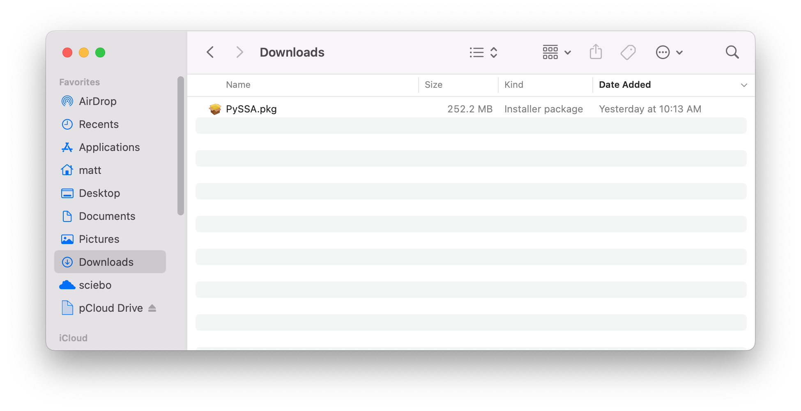

After you double clicked on the PySSA.pkg file, you have to follow the instructions on the
screen.

1. Click on *Continue*.
-----------------------------

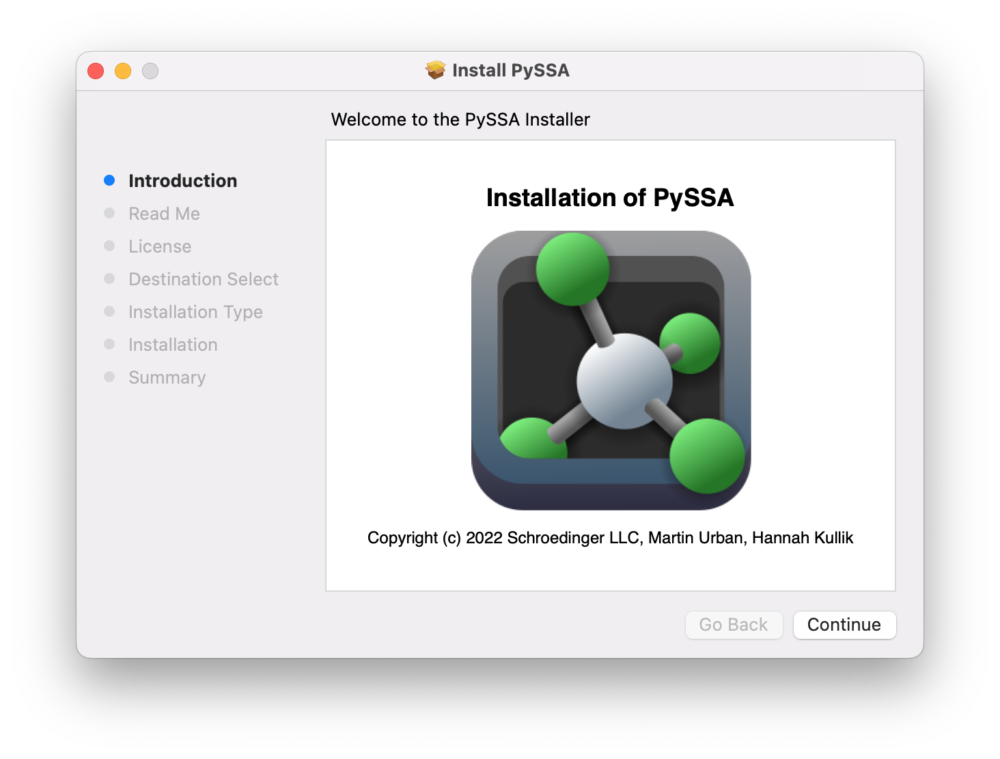

2. Read the README text.
------------------------
This describes the installation in a few words.

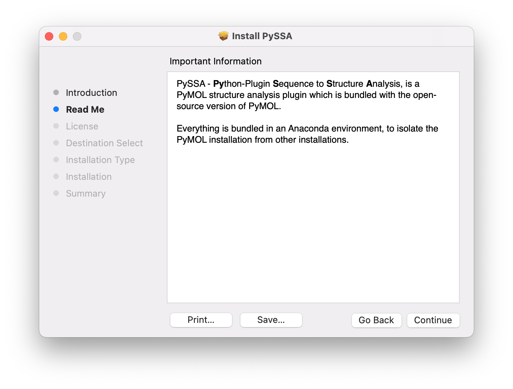

3. Read the license information.
--------------------------------
Be aware that there is one license for the open-source
PyMOL and one for the PySSA plugin!

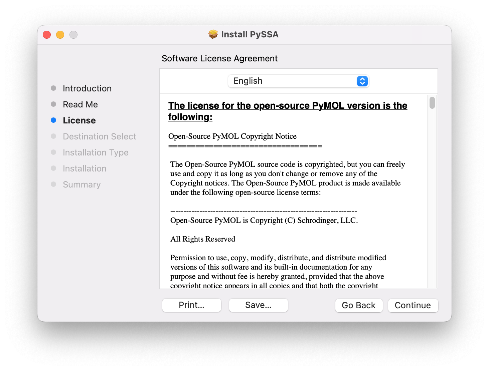

4. Agree to the license information.
------------------------------------
If you wish to install the software package, you have to agree to the two licenses!

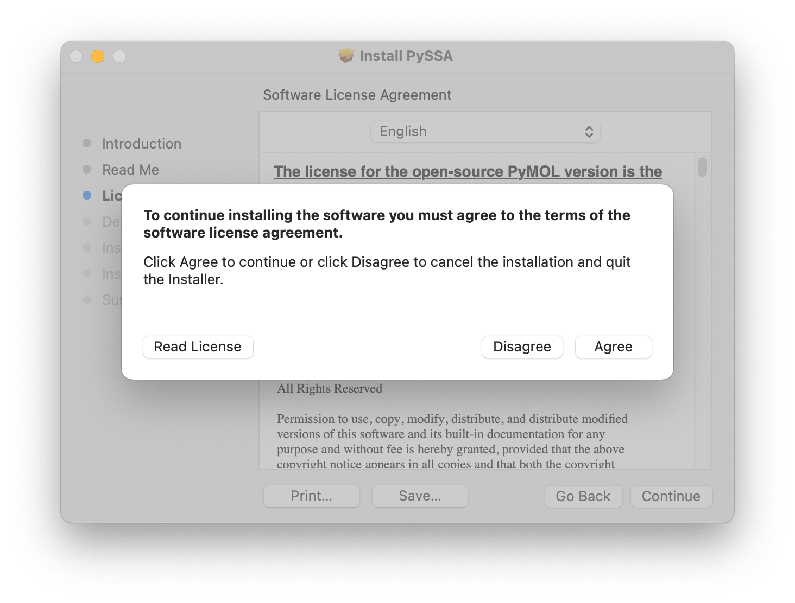

5. Check if your hard disk is detected by the installer.
--------------------------------------------------------
In the example, it is the MacSSD. If it is correct, click on *Install*.

.. image:: assets/installation_type.png

6. Enter your sudo password.
---------------------------------------------------------
Root privileges are needed for the installation process, because the application is
installed under the root Applications directory.

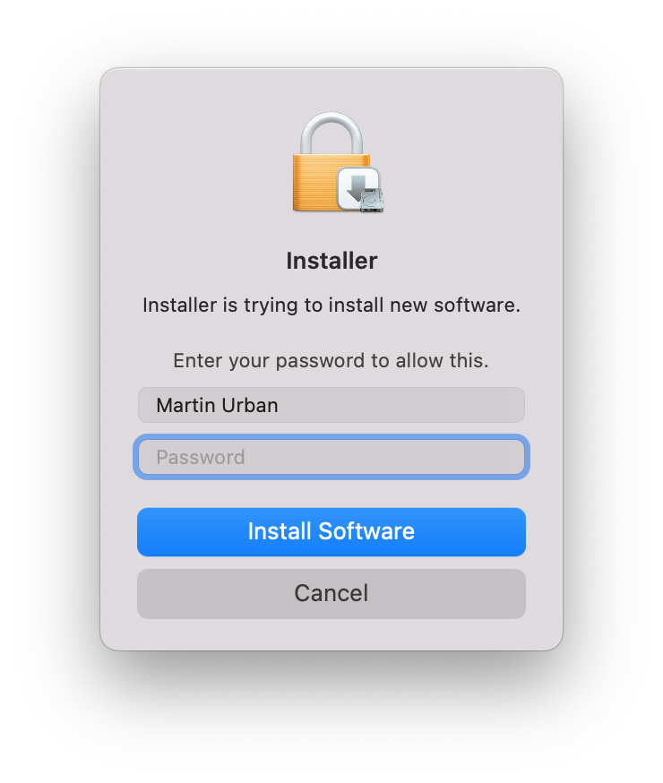

Start the application
---------------------
Now you can start PySSA, by either searching with Spotlight or navigating to the Applications
folder and double click on the application.

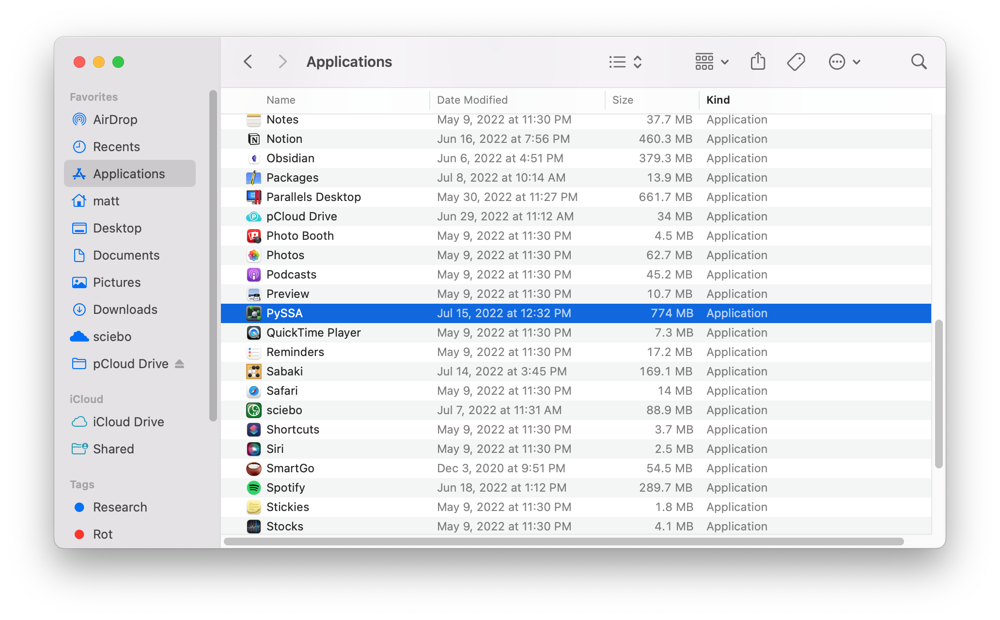

Uninstall
---------
To uninstall PySSA, you have to delete the PySSA directory under the Applications folder.
This can be done by clicking once on the PySSA software in the Applications folder and
press cmd + backspace to remove the directory.

Linux
=====
**Caution**: The PySSA.pkg contains a fully functional open-source version of PyMOL +
the PySSA plugin.
Therefore you do not need a PyMOL!
The plugin will also not be integrated in previous PyMOL installations!

The installation was tested on a Fedora 35 system.

To install the the PyMOL-PySSA bundle, you have to run the install.sh script.
This is located in the downloaded PySSA_setup_linux.tar.gz.

1. Extract the PySSA_setup_linux.tar.gz.
----------------------------------------
This can be done by entering following command:

.. code-block:: sh

    tar -xvf PySSA_setup_linux.tar.gz && cd PySSA_setup_linux

2. Make install.sh executable.
------------------------------
The next step is to make the install script executable. This can be done by following
command:

.. code-block:: sh

    chmod +x install.sh

3. Run the install.sh script.
-----------------------------
The last step to install the bundle is, to run the install.sh script.

.. code-block:: sh

    ./install.sh

Before the installation process starts, you have to agree to the license information!

Start the application
---------------------
To start the application, search for PySSA and click on the icon.

Uninstall
---------
To uninstall the bundle, you have to navigate to the program directory, which is
under /opt/PySSA.
There are two uninstall scripts. The one called "uninstall.sh" removes everything.
The one called "uninstall_version.sh" removes only the version given in the
filename.
To run these scripts, you have to make them executable and run them as sudo!

