==============
 Installation
==============

Windows
=======
**Caution**: The PySSA_setup.exe contains a fully functional open-source version of PyMOL +
the PySSA plugin.
Therefore you do not need a PyMOL!
The plugin will also not be integrated in previous PyMOL installations!

The installation process was tested on a Windows 10 21H2 and on a Windows 11 21H2 system.

To start the installation process, double click on the
downloaded PySSA_setup.exe.

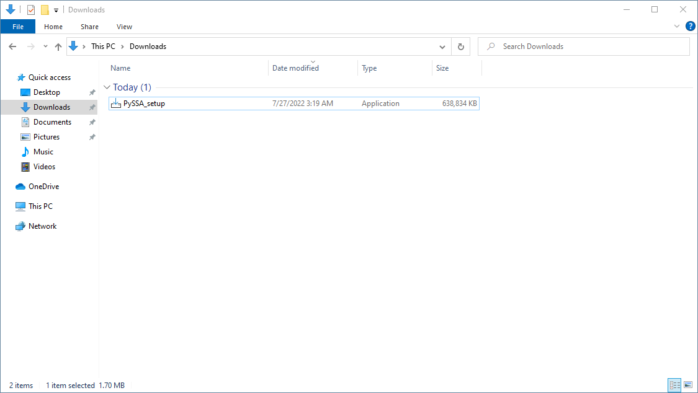

    Figure 1: Download directory with PySSA_setup.exe.

It is possible that the Windows Defender will pick up
the installer. If that happens, click on *More Info*
and on *Run Anyway*.

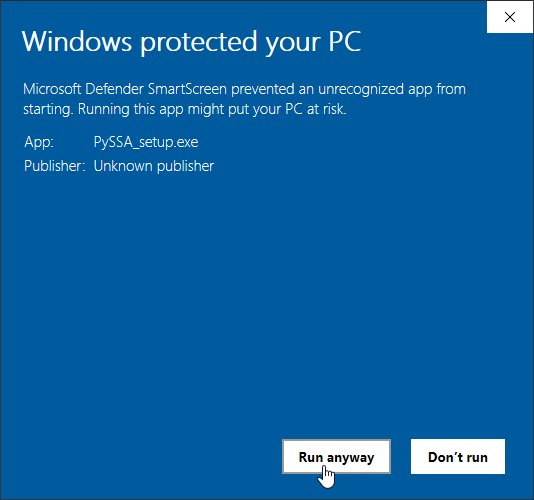

    Figure 2: Windows Defender message.

1. Confirm start of installation.
---------------------------------
After that, a small dialog will open, which asks you,
if you want to install the PySSA software.
Click on *Yes* to continue.

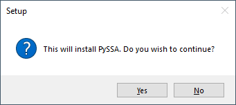

    Figure 3: Agree to installation process.

2. Grant Admin privileges.
--------------------------
Next, a dialog will open, which asks you to confirm
you have the right privileges to run the setup.
(Admin privileges are needed!)
After the confirmation the introduction dialog will open.

3. Click on *Next*.
-------------------
There you can click on *Next*.

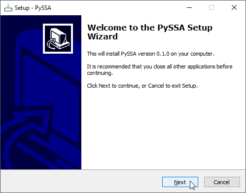

    Figure 4: Welcome installation page.

4. Agree to both licenses.
--------------------------
Read both licenses. One is for the open-source version of PyMOL
and the other is for the PySSA.

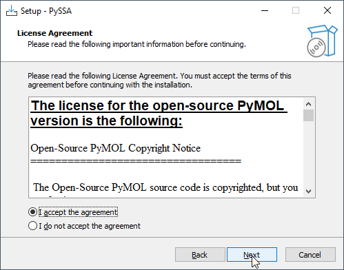

    Figure 5: Licence Agreements for PyMOL and PySSA.

5. Confirm destination location.
--------------------------------
You should **not** change the pre-defined destination folder!

Just click on *Next*.

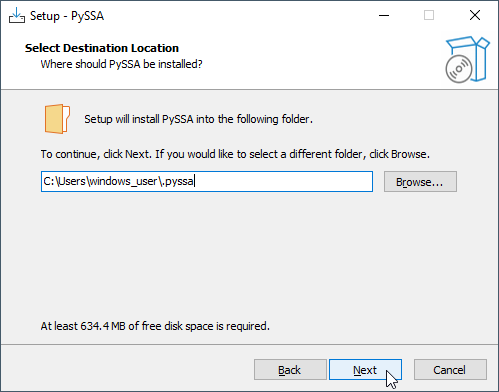

    Figure 6: Define destination folder.

6. Confirm start menu folder.
-----------------------------
You should **not** change the default value!

Just click on *Next*.

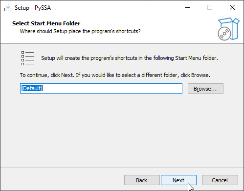

    Figure 7: Start Menu folder.

7. Install open-source version of PyMOL.
----------------------------------------
To install the open-source version of PyMOL, click on *Install*.
Please wait until the finish page of the setup wizard is displayed.
Do **not** close any windows during the installation!

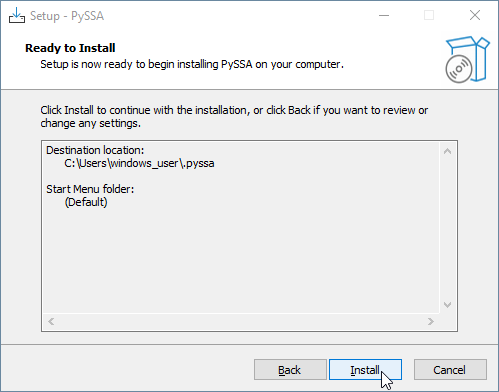

    Figure 8: Install confirmation.

8. Finish installation of open-source PyMOL.
---------------------------------------------
Finally, to finish the setup, click on *Finish*.

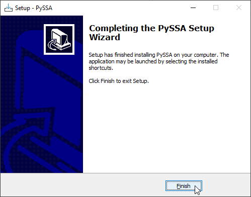

    Figure 9: Finish page of setup wizard.

9. Start PyMOL-PySSA.
----------------------
To install the PySSA PyMOL plugin, you have to start PyMOL with by clicking on the
*PyMOL-PySSA* desktop icon.

    Figure 10: Desktop shortcut for PyMOL-PySSA.

10. Navigate to *Plugin*.
-------------------------
After you successfully launched PyMOL, navigate in the menu bar to *Plugin*.

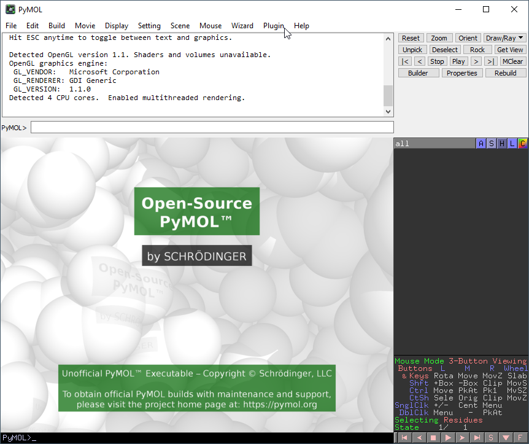

11. Open the *Plugin Manager*.
------------------------------
If you click on *Plugin* in the menu bar, a dropdown menu will occur. There you have to click on
*Plugin Manager*.

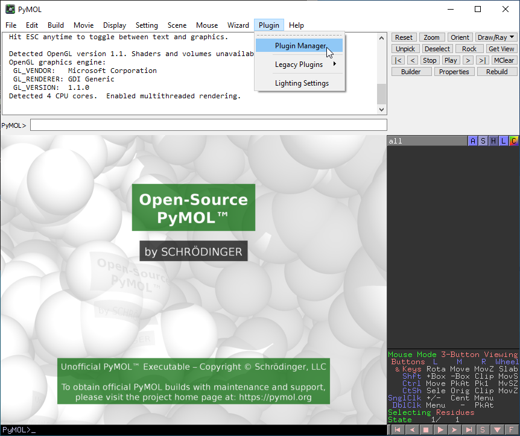

12. Install New Plugin.
-----------------------
In the Plugin Manager, navigate to *Install New Plugin* and then click on *Choose file ...*.

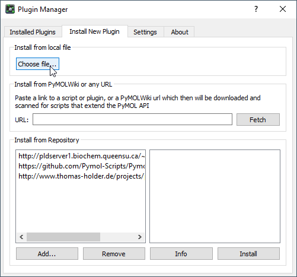

13. Open the PySSA.zip.
-----------------------
After you clicked on *Choose file ...* a file dialog will open. There you have to click on *.pyssa*
in the top bar of the explorer.

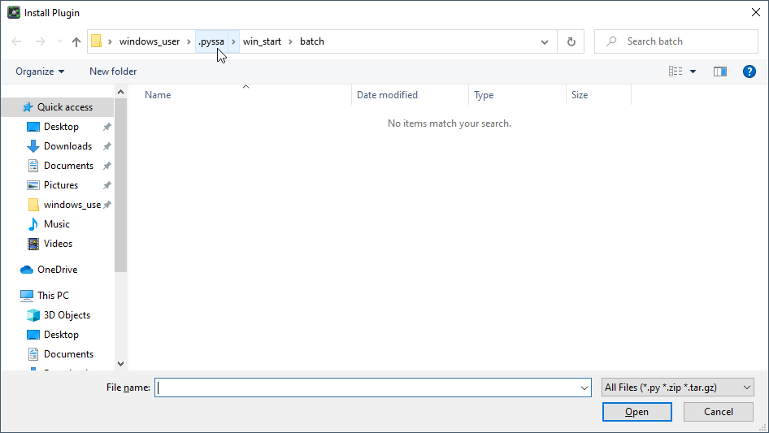

After you clicked on *.pyssa*, the folder will open and there you have to click on *pyssa.zip*.
And then on *Open*.

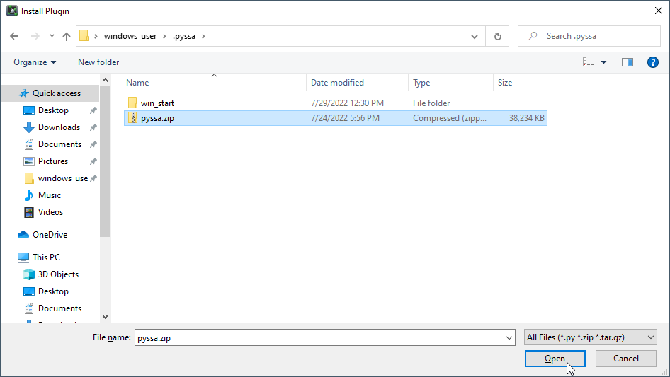

14. Confirm Installation Path.
------------------------------
Next, a dialog will open, which displays a file path.

Just click on *OK*. And wait a little bit.

Do **not** change the path!

.. image:: assets/images_win/win_pymol_plugin_install_path.png
    :align: center

15. Confirm Installation.
-------------------------
If the installation was successful, a dialog will open which says that
the plugin was installed successfully.

There you have to click on *OK*.

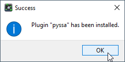

16. Open the PySSA Plugin.
--------------------------
To open the PySSA plugin, navigate to *Plugin* and click on *PySSA*.
The plugin should open, after a few seconds.

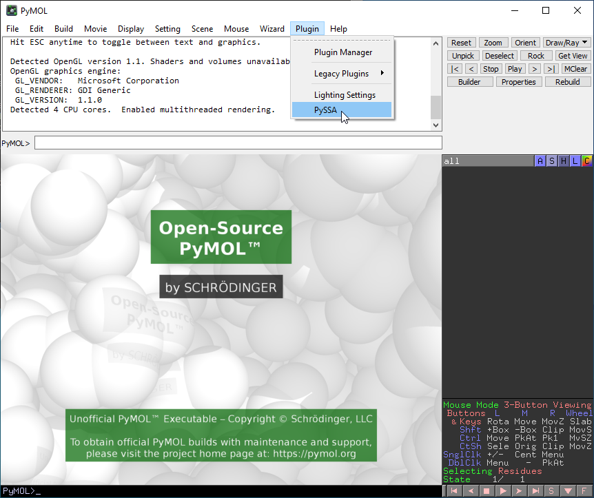

    Figure 11: Start the PySSA-Plugin.

17. Install WSL2.
-----------------
To install the WSL2, first click on *Edit all* under *Settings*.
Then on *Install* under *WSL2*.

.. figure:: assets/images_win/win_settings_edit_all.png
    :align: center
    :scale: 75%

    Figure 12: Settings menu.

18. Install Local Prediction.
-----------------------------
To install the Local Prediction, click on *Install* under *Local Prediction*.

.. figure:: assets/images_win/win_install_local_prediction.png
    :align: center
    :scale: 75%

    Figure 13: Settings Edit all dialog.

Uninstall
---------

Local Prediction
^^^^^^^^^^^^^^^^
1. Click on *Uninstall*
~~~~~~~~~~~~~~~~~~~~~~~
In the *Edit all* settings dialog, click on *Uninstall*, to remove the Local Prediction.

WSL2
^^^^^^^^^^^^^^^^
1. Click on *Uninstall*
~~~~~~~~~~~~~~~~~~~~~~~
In the *Edit all* settings dialog, click on *Uninstall*, to remove the WSL2.

.. figure:: assets/images_win/win_edit_all_uninstall_wsl2.png
    :align: center
    :scale: 75%

    Figure 14: Settings Edit all dialog, uninstall WSL2.

2. Confirm removal process
~~~~~~~~~~~~~~~~~~~~~~~~~~
In the pop-up dialog, click on *Yes*, if you want to remove the WSL2.

.. figure:: assets/images_win/win_ask_uninstall_wsl2.png
    :align: center
    :scale: 75%

    Figure 15: WSL2 uninstall confirmation pop-up dialog.

3. Click on *Ok*
~~~~~~~~~~~~~~~~
In the next pop-up click on *Ok* and follow the next steps in this documentation to remove the WSL2.

.. figure:: assets/images_win/win_uninstall_wsl2.png
    :align: center
    :scale: 75%

    Figure 16: WSL2 information pop-up dialog.

4. Go to the windows "Settings"
~~~~~~~~~~~~~~~~~~~~~~~~~~~~~~~
Navigate to your Windows "Settings".

5. Go to "Apps"
~~~~~~~~~~~~~~~
Within the "Settings" go to the "Apps" section.

6. Go to "Installed Apps"
~~~~~~~~~~~~~~~~~~~~~~~~~
On the "Apps" page, select "Installed Apps".

7. Uninstall Ubuntu
~~~~~~~~~~~~~~~~~~~
Next, search for Ubuntu in the search bar. And click on the three dots
and then on uninstall.

8. Uninstall Linux Subsystem for Windows
~~~~~~~~~~~~~~~~~~~~~~~~~~~~~~~~~~~~~~~~
The last step is to search for Linux in the search bar. And click on the three dots
and then on uninstall. After that you should have completely removed the WSL2 from your system.

PySSA
^^^^^^^^

1. Search for "programs" in Windows search bar.
~~~~~~~~~~~~~~~~~~~~~~~~~~~~~~~~~~~~~~~~~~~~~~~
To remove the PySSA, search in the Windows search bar for "programs".

Then choose "Add or remove programs".

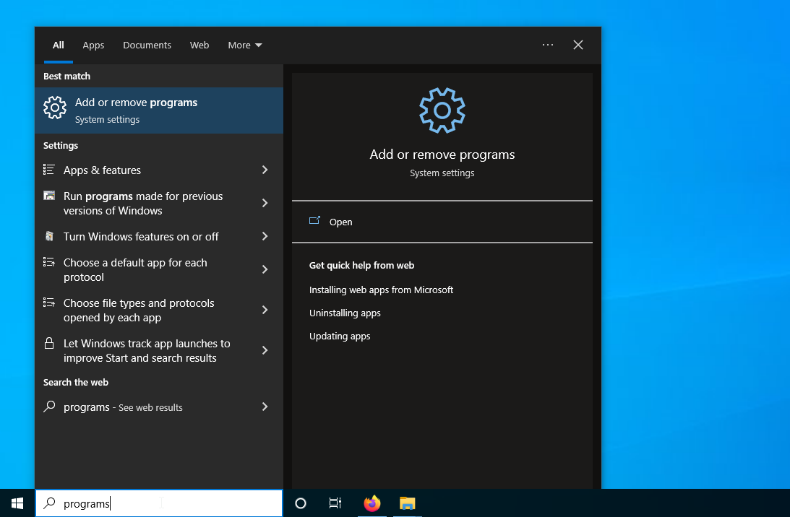

2. Select Uninstall.
~~~~~~~~~~~~~~~~~~~~
Go through the list of programs and find the PySSA program.
After that, you click on *Uninstall*.

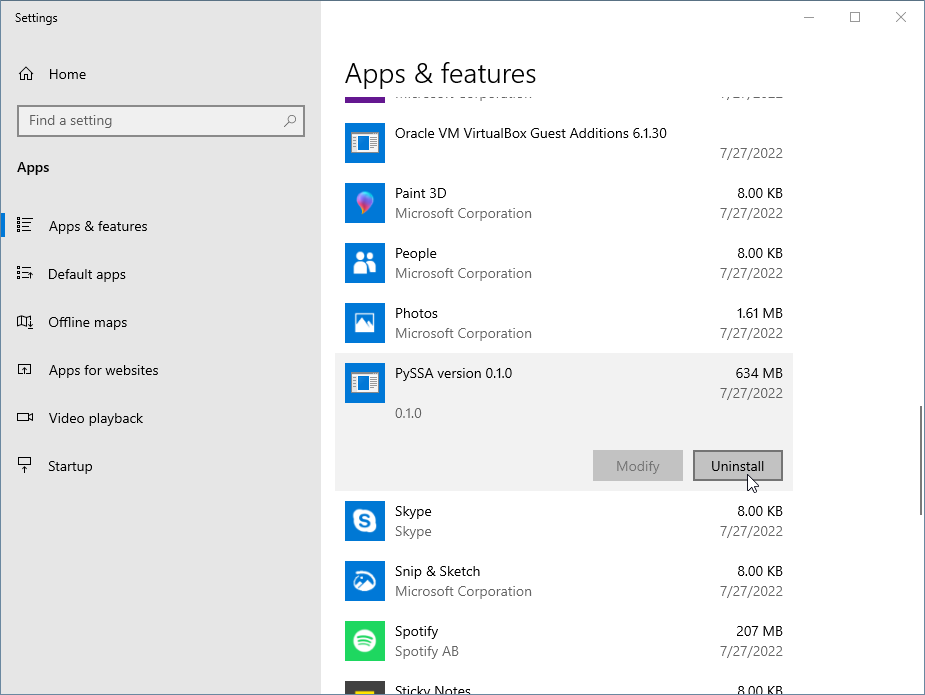

3. Uninstall PySSA.
~~~~~~~~~~~~~~~~~~~
To finally uninstall the PySSA click on *Uninstall* in the new dialog window, which appeared after
the last Uninstall-click. This uninstalls also the open-source version of PyMOL!

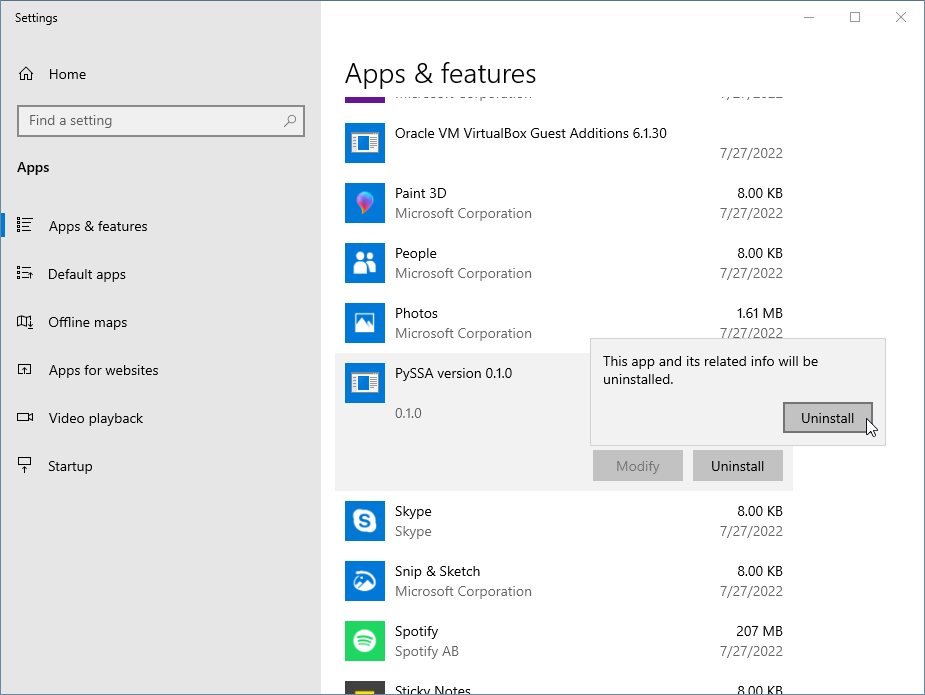
