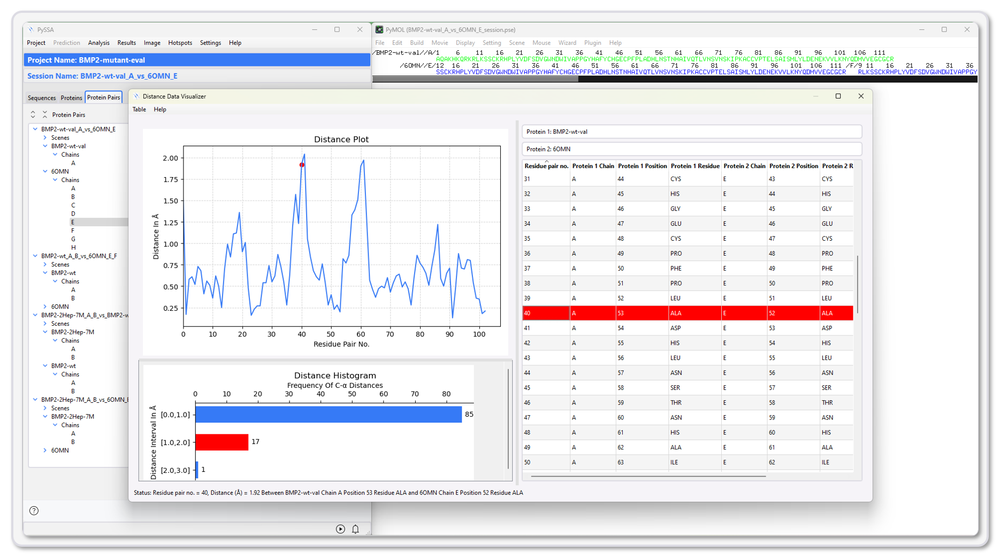
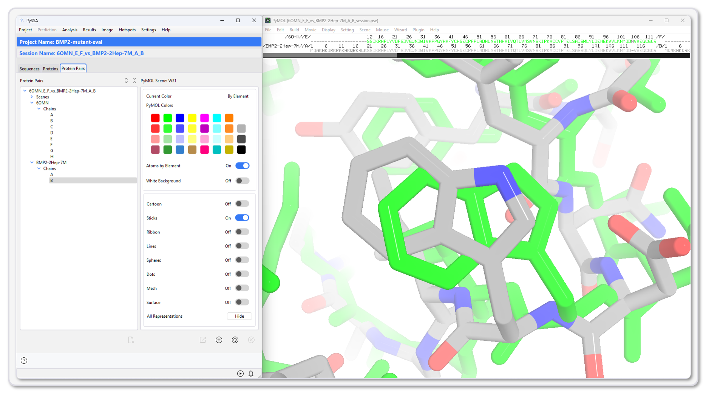

PySSA
=====

.. raw:: html

    <section style="background-image: url('_static/Figure3.png'); background-size: cover; background-position: center; height: 400px; display: flex; justify-content: center; align-items: center; color: white; text-align: center; position: relative;">
        

        

            <h1 style="font-size: 2.5em; margin: 0;">PySSA: 3D Structure Prediction and Analysis</h1>
            
Python rich client for protein Sequence-to-Structure Analysis

        

    </section>

.. raw:: html

    
     

.. raw:: html

    

        PySSA ('Python rich client for protein Sequence-to-Structure Analysis') is an open software project that
        aims to provide structure predictions done with ColabFold and molecular visualization with PyMOL to enable the prediction and analysis of
        3D protein structures for the scientific end-user.
    

.. raw:: html

    
     

.. grid:: 4

    .. grid-item-card::  :material-outlined:`folder_shared;2em` Project Management
        :img-background: _static/pyssa_blue-32.png
        :class-card: sd-text-white
        :link: https://example.com

        Import, export, create and delete projects.

    .. grid-item-card:: :material-outlined:`memory;2em` 3D Structure Prediction
        :img-background: _static/pyssa_blue-32.png
        :class-card: sd-text-white
        :link: https://example.com

        Monomeric and multimeric protein predictions.

    .. grid-item-card:: :material-outlined:`compare;2em` Structure Analysis
        :img-background: _static/pyssa_blue-32.png
        :class-card: sd-text-white
        :link: https://example.com

        Distance analysis of protein pairs.

    .. grid-item-card:: :material-outlined:`image;2em` Images
        :img-background: _static/pyssa_blue-32.png
        :class-card: sd-text-white
        :link: https://example.com

        Creation of ray-traced or simple images.

.. raw:: html

    
     

.. raw:: html

    

        PySSA allows the creation of managed and shareable projects with defined workflows for
        the prediction and analysis of protein structures,
        which can be conveniently carried out by scientists without
        any special computer skills or programming knowledge on their local computers.
    

.. raw:: html

    
     

.. raw:: html

    

        PySSA can help make protein structure prediction accessible for research and
        development in protein chemistry and molecular biology, and for teaching.
    

.. raw:: html

    
     

.. raw:: html

    

        In addition to the prediction and analysis capabilities, PySSA has a more user-friendly interface
        for interacting with PyMOL, such as creating high-quality ray-tracing images in a few clicks.
    

.. toctree::
   :hidden:
   :maxdepth: 1

   help/help
   getting_started/getting_started
   development/development
